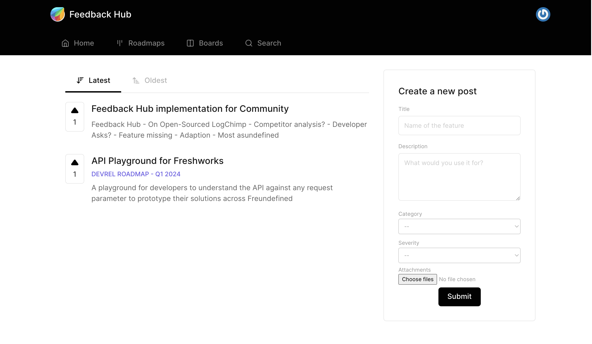

  

  Track developer feedbacks from Freshworks Developer Community into a single place using Feedback Hub

<h4 align="center">
  <a href="https://community.freshworks.dev">Website</a>
   • 
  <a href="https://freshworks.dev/docs/">Docs</a>
   • 
  <a href="https://freshworks.dev/docs/guides">Guides</a>
</h4>
 

## Features

* 🎨 Freshworks Branding
* 📝 Customised posts creation
* 🗃️ Organise posts by Boards & Roadmaps
* 💪 Powerful dashboard
* 🔐 Secure by design
* 🤖 Self-hosted

## Getting started

To get started you can read our [Setup Guide](./SETUP.md) to setup the project locally

## ⛏️ Built Using

Built on top of Project [LogChimp](https://logchimp.codecarrot.net). The project tech stack is fairly easy.

- **Express** - APIs
- **PostgresQL** - Database
- **Vue 3** + **Vite.js** - Theme

